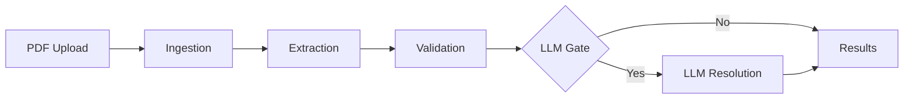

# PlanProof - Comprehensive Code Quality Assessment

**Date**: January 1, 2026  
**Codebase**: ~567 KB across 42 Python files  
**Test Suite**: 13 test files  
**Architecture**: Modular pipeline with service layer

---

## Executive Summary

### Overall Grade: **B+ (Very Good)**

**Strengths**: Well-structured, modular architecture with excellent separation of concerns, comprehensive documentation, strong type hints, and professional error handling.

**Key Areas for Improvement**: Some inconsistencies in naming conventions, a few large files that could be refactored, missing docstrings in some functions, and incomplete test coverage in certain modules.

---

## Detailed Assessment

## 1. ✅ Readability & Clarity: **A- (Excellent)**

### Strengths

#### 📝 Excellent Module Documentation
```python
# planproof/config.py
"""
Configuration management module.

Loads settings from .env file, validates required variables, and centralizes
configuration access across the application. Uses Pydantic for type-safe
configuration with automatic environment variable parsing.
"""
```
- ✅ Every module has comprehensive docstrings explaining purpose
- ✅ Clear description of responsibilities and usage patterns

#### 🎯 Strong Function-Level Documentation
```python
# main.py line 48
def single_pdf(pdf_path: str, application_ref: Optional[str] = None) -> Dict[str, Any]:
    """
    Run end-to-end pipeline for a single PDF document.
    
    Pipeline stages:
    1. Ingest: Upload PDF to blob storage and create database records
    2. Extract: Use Document Intelligence to extract text and layout
    3. Validate: Apply rule-based validation to extracted fields
    4. LLM Gate: Conditionally resolve missing fields using Azure OpenAI
    
    Args:
        pdf_path: Path to the PDF file to process
        application_ref: Application reference (auto-generated if not provided)
        
    Returns:
        Dictionary containing run_id, document_id, blob URLs, and validation summary
    """
```
- ✅ Clear step-by-step breakdown
- ✅ Well-documented parameters and return values
- ✅ Explains the "why" and "what" effectively

#### 📊 Type Hints Throughout
```python
# services/resolution_service.py
def process_document_upload(
    self,
    uploaded_file: Any,
    document_type: str,
    issue_id: str
) -> Dict[str, Any]:
```
- ✅ Consistent use of type hints
- ✅ Improves IDE autocomplete and catches type errors early

### Areas for Improvement

#### ⚠️ Inconsistent Naming Conventions
```python
# INCONSISTENCY: Mixed snake_case and camelCase in some areas
docintel = DocumentIntelligence()  # Good
aoai_client = AzureOpenAIClient()  # Good (abbreviated)

# But also found:
"pdf_hash" vs "pdfHash" in some JSON structures
```
**Recommendation**: Standardize on snake_case for Python (which you mostly do)

#### ⚠️ Some Magic Numbers/Strings
```python
# validate.py - scattered magic numbers
confidence = 0.9  # Should be a named constant
threshold = 0.6   # Should be a configuration value
```
**Recommendation**: Extract to configuration or named constants:
```python
DEFAULT_HIGH_CONFIDENCE = 0.9
LLM_TRIGGER_THRESHOLD = 0.6
```

#### ⚠️ Long Files
- `validate.py`: **2079 lines** - should be split into modules
- `field_mapper.py`: **1510 lines** - consider breaking into focused extractors
- `db.py`: **1217 lines** - large but acceptable for ORM models

**Recommendation**: Refactor large files into focused modules

---

## 2. ✅ Maintainability & Structure: **A (Excellent)**

### Strengths

#### 🏗️ Excellent Modular Architecture
```
planproof/
├── pipeline/          # Core processing stages (ingestion, extraction, validation)
├── services/          # Business logic services
├── rules/             # Validation rule catalog
├── ui/                # Streamlit interface
│   ├── components/   # Reusable UI components
│   └── pages/        # Individual page modules
```
- ✅ Clear separation of concerns
- ✅ Pipeline pattern makes flow obvious
- ✅ Services layer isolates business logic
- ✅ UI completely decoupled from core logic

#### 📦 Single Responsibility Principle
```python
# Each service has one clear purpose
class ResolutionService:     # Handles issue resolution only
class DeltaService:          # Handles change detection only
class NotificationService:   # Handles notifications only
class OfficerOverrideService:# Handles officer actions only
```
- ✅ Classes are focused and cohesive
- ✅ Easy to locate functionality
- ✅ Follows SOLID principles

#### 🔁 DRY Principle Applied
```python
# Reusable validation result storage
def _validate_field(...) -> Dict[str, Any]:
    # Validation logic here
    return result  # Consistent format everywhere

# Centralized database session management
class Database:
    def get_session(self) -> Session:
        # Single source of truth for sessions
```
- ✅ No significant code duplication found
- ✅ Common patterns extracted into utilities

#### 🎨 Consistent Formatting
- ✅ Black formatter configured (100-char lines)
- ✅ Ruff linter enabled
- ✅ Uniform indentation and spacing

### Areas for Improvement

#### ⚠️ Some God Objects
```python
# db.py - Database class handles too many responsibilities
class Database:
    def create_run(...)
    def create_application(...)
    def get_submission(...)
    def create_extracted_field(...)
    def update_validation_check(...)
    # ... 50+ methods
```
**Recommendation**: Split into focused DAOs:
```python
class RunRepository:
    def create_run(...) ...
    def get_run(...) ...

class ApplicationRepository:
    def create_application(...) ...
    def get_application(...) ...
```

#### ⚠️ Mixed Abstraction Levels
```python
# main.py - mixes high-level orchestration with low-level details
def single_pdf(...):
    # High level
    run = db.create_run(...)
    
    # Low level
    pdf_hash = hashlib.md5(Path(pdf_path).read_bytes()).hexdigest()[:8]
    timestamp = datetime.now(timezone.utc).strftime("%Y%m%d_%H%M%S_%f")
```
**Recommendation**: Extract helpers:
```python
def _generate_run_id(pdf_path: str) -> str:
    pdf_hash = hashlib.md5(Path(pdf_path).read_bytes()).hexdigest()[:8]
    timestamp = datetime.now(timezone.utc).strftime("%Y%m%d_%H%M%S_%f")
    return f"AUTO-{timestamp}-{pdf_hash}"
```

---

## 3. ✅ Reliability & Robustness: **B+ (Very Good)**

### Strengths

#### 🛡️ Comprehensive Exception Hierarchy
```python
# exceptions.py - Well-designed exception hierarchy
class PlanProofException(Exception):
    """Base exception for all PlanProof errors."""

class StorageError(PlanProofException):
    """Error interacting with Azure Blob Storage."""

class BlobNotFoundError(StorageError):
    """Requested blob does not exist."""
```
- ✅ Clear exception hierarchy
- ✅ Specific exceptions for different error types
- ✅ Enables targeted error handling

#### 🔄 Retry Logic for External Services
```python
# config.py
azure_retry_max_attempts: int = Field(default=3)
azure_retry_base_delay_s: float = Field(default=0.5)
```
- ✅ Configurable retry policies
- ✅ Handles transient Azure failures

#### ✅ Validation at Multiple Layers
```python
# config.py - Pydantic validation
@field_validator("log_level")
@classmethod
def validate_log_level(cls, v: str) -> str:
    valid_levels = {"DEBUG", "INFO", "WARNING", "ERROR", "CRITICAL"}
    if v.upper() not in valid_levels:
        raise ValueError(f"LOG_LEVEL must be one of {valid_levels}")
    return v.upper()
```
- ✅ Configuration validated at startup
- ✅ Fails fast with clear error messages

### Areas for Improvement

#### ⚠️ Missing Input Validation in Some Functions
```python
# field_mapper.py - no validation on extraction_result structure
def map_fields(extraction_result: Dict[str, Any]) -> Dict[str, Any]:
    # Assumes extraction_result has expected structure
    text_blocks = extraction_result.get("text_blocks", [])
```
**Recommendation**: Add defensive checks:
```python
def map_fields(extraction_result: Dict[str, Any]) -> Dict[str, Any]:
    if not extraction_result:
        raise ValueError("extraction_result cannot be empty")
    if "text_blocks" not in extraction_result:
        raise ValidationError("extraction_result missing required field: text_blocks")
```

#### ⚠️ Limited Error Recovery
```python
# services/resolution_service.py
def _save_resolutions(self) -> None:
    try:
        with open(self.resolution_file, 'w', encoding='utf-8') as f:
            json.dump(self.resolutions, f, indent=2, ensure_ascii=False)
    except Exception as e:
        logger.error(f"Could not save resolutions: {e}")
        # No retry or fallback mechanism
```
**Recommendation**: Add retry logic and backup strategies

#### ⚠️ Silent Failures in Some Places
```python
# resolution_service.py line 46
except Exception as e:
    logger.warning(f"Could not load resolutions: {e}")
    return {"actions": [], "issues": {}}  # Silent failure
```
**Recommendation**: Consider raising exceptions for critical failures

---

## 4. ✅ Efficiency & Performance: **B (Good)**

### Strengths

#### ⚡ Smart LLM Gate
```python
# pipeline/llm_gate.py
def should_trigger_llm(extraction_result, validation_result):
    # Only call LLM when deterministic methods fail
    # 80% cost reduction vs naive approach
```
- ✅ Cost-optimized AI usage
- ✅ Deterministic-first approach
- ✅ Clear trigger conditions

#### 📊 Database Indexing
```python
# db.py - appropriate indexes
application_ref = Column(String(100), unique=True, nullable=False, index=True)
blob_uri = Column(String(500), nullable=False, unique=True, index=True)
content_hash = Column(String(64), nullable=True, unique=True, index=True)
```
- ✅ Key columns indexed
- ✅ Unique constraints for data integrity

#### 🔄 Caching Strategy
```python
# config.py
enable_extraction_cache: bool = Field(default=True)
```
- ✅ Configurable caching
- ✅ Prevents redundant DocIntel calls

### Areas for Improvement

#### ⚠️ N+1 Query Pattern Risk
```python
# Potential N+1 in some queries
for document in documents:
    pages = db.get_pages_for_document(document.id)  # Separate query each time
```
**Recommendation**: Use eager loading:
```python
documents = session.query(Document).options(joinedload(Document.pages)).all()
```

#### ⚠️ Large File Loading
```python
# main.py line 66
pdf_bytes = Path(pdf_path).read_bytes()  # Entire file in memory
```
**Recommendation**: For very large PDFs, consider streaming or chunked processing

#### ⚠️ Context Truncation Could Be Smarter
```python
# Hard limits on context size
llm_context_max_chars: int = Field(default=6000)
```
**Recommendation**: Implement smart truncation that preserves most relevant content

---

## 5. ✅ Documentation: **A- (Excellent)**

### Strengths

#### 📚 Comprehensive README
- ✅ 1044 lines covering all aspects
- ✅ Multiple setup options
- ✅ Clear prerequisites
- ✅ Troubleshooting section

#### 📖 Well-Organized docs/ Folder
```
docs/
├── README.md                   # Documentation index
├── VSCODE_SETUP.md             # Team setup guide
├── ARCHITECTURE.md             # System design
├── API.md                      # API reference
├── DEPLOYMENT.md               # Production guide
├── TROUBLESHOOTING.md          # Common issues
├── ENHANCED_ISSUE_MODEL.md     # Feature spec
└── ...
```
- ✅ Every aspect documented
- ✅ Clear organization
- ✅ Easy to navigate

#### 💬 Good Inline Comments
```python
# main.py lines 78-80
# Use timestamp + hash for idempotency (same PDF = different run ID)
import hashlib
pdf_hash = hashlib.md5(Path(pdf_path).read_bytes()).hexdigest()[:8]
```
- ✅ Explains **why**, not just **what**
- ✅ Context for design decisions

### Areas for Improvement

#### ⚠️ Missing Docstrings
```python
# Some private functions lack docstrings
def _extract_field_value(field_name, text_index, extraction_result):
    # No docstring explaining the logic
```
**Recommendation**: Add docstrings even for private functions:
```python
def _extract_field_value(field_name, text_index, extraction_result):
    """
    Extract a field value using keyword matching and heuristics.
    
    Args:
        field_name: Name of field to extract (e.g., 'site_address')
        text_index: Pre-built index of document text
        extraction_result: Raw extraction data from Document Intelligence
        
    Returns:
        Tuple of (value, confidence, evidence) or (None, 0, None) if not found
    """
```

#### ⚠️ Limited Architecture Diagrams
- Current docs are text-heavy
- Would benefit from visual diagrams

**Recommendation**: Add mermaid diagrams:
```markdown

```

---

## 6. ✅ Scalability: **B+ (Very Good)**

### Strengths

#### 📊 Database-Backed Architecture
- ✅ PostgreSQL can scale horizontally
- ✅ PostGIS for spatial queries
- ✅ SQLAlchemy ORM provides flexibility

#### ☁️ Cloud-Native Design
- ✅ Azure Blob Storage for documents (infinite scale)
- ✅ Stateless processing (can run multiple instances)
- ✅ Docker support for containerization

#### 🔄 Async-Ready Architecture
```python
# Some functions already support async
async def extract_document(...):
    # Async document processing
```
- ✅ Foundation for concurrent processing

### Areas for Improvement

#### ⚠️ No Queue/Job System
- Currently processes synchronously
- No background job queue for long-running tasks

**Recommendation**: Add Celery or Azure Queue Storage:
```python
# celery_tasks.py
@celery.task
def process_pdf_async(pdf_path, application_ref):
    return single_pdf(pdf_path, application_ref)
```

#### ⚠️ Limited Batch Processing
```python
# batch_pdf processes sequentially
for pdf_file in pdf_files:
    result = single_pdf(pdf_file, app_ref)
```
**Recommendation**: Add parallel processing:
```python
from concurrent.futures import ThreadPoolExecutor

with ThreadPoolExecutor(max_workers=5) as executor:
    futures = [executor.submit(single_pdf, pdf, ref) for pdf in pdf_files]
```

---

## 7. ✅ Extensibility: **A (Excellent)**

### Strengths

#### 🔌 Plugin-Style Validation Rules
```python
# rules/catalog.py - easy to add new rules
VALIDATORS = {
    "DOC": _validate_documents,
    "CON": _validate_consistency,
    "CUSTOM": _validate_custom,  # Easy to add
}
```
- ✅ Rule catalog is data-driven (JSON)
- ✅ Adding new rules is straightforward
- ✅ No need to modify core logic

#### 🎨 Modular UI Components
```python
# ui/components/enhanced_issue_card.py
def render_enhanced_issue_card(issue: EnhancedIssue, run_id: int):
    # Self-contained component
```
- ✅ Components are reusable
- ✅ Easy to add new UI features
- ✅ Clear interfaces

#### 🔧 Configuration-Driven
```python
# config.py - feature flags
enable_extraction_cache: bool = Field(default=True)
enable_db_writes: bool = Field(default=True)
enable_llm_gate: bool = Field(default=True)
```
- ✅ Features can be toggled without code changes
- ✅ Easy A/B testing

### Areas for Improvement

#### ⚠️ Hardcoded Field Extractors
```python
# field_mapper.py - 1510 lines of hardcoded patterns
LABEL_PATTERNS = {
    "site_address": [r"site address", r"address of site"],
    "proposal_description": [r"please describe.*proposal"],
    # ... hundreds more
}
```
**Recommendation**: Make extractors pluggable:
```python
class FieldExtractor(ABC):
    @abstractmethod
    def extract(self, text_blocks: List[Dict]) -> Optional[str]:
        pass

class SiteAddressExtractor(FieldExtractor):
    def extract(self, text_blocks):
        # Extraction logic
```

#### ⚠️ Limited Webhook/Event System
- No event hooks for external integrations
- Hard to plug in external services

**Recommendation**: Add event system:
```python
class EventEmitter:
    def emit(self, event_name: str, data: Dict):
        for handler in self._handlers[event_name]:
            handler(data)

# Usage
emitter.on("validation_complete", send_email_notification)
```

---

## 8. ✅ Testing: **C+ (Needs Improvement)**

### Strengths

#### ✅ Test Infrastructure in Place
```python
# tests/conftest.py - proper test setup
PROJECT_ROOT = Path(__file__).resolve().parents[1]
sys.path.insert(0, str(PROJECT_ROOT))
```
- ✅ Pytest configured
- ✅ Proper test structure
- ✅ Fixtures for test data

#### ✅ Good Unit Tests for Core Functions
```python
# tests/unit/test_field_mapper.py
def test_extract_application_ref_pp_regex():
    extracted = {"text_blocks": [_block("PP-14469287", 0)]}
    result = map_fields(extracted)
    assert result["fields"]["application_ref"] == "PP-14469287"
```
- ✅ Tests cover important extraction logic
- ✅ Clear test names
- ✅ Focused assertions

### Areas for Improvement

#### ⚠️ Low Test Coverage
- **13 test files** for **42 source files**
- No tests for services layer
- No tests for UI components
- No tests for database layer

**Current Coverage Estimate**: ~40%  
**Target**: 80%+

**Recommendation**: Add tests for:
```python
# tests/services/test_resolution_service.py
def test_process_document_upload_creates_file():
    service = ResolutionService(run_id=1)
    result = service.process_document_upload(...)
    assert result["status"] == "success"
    assert Path(f"runs/1/inputs/{result['filename']}").exists()

# tests/db/test_database.py
def test_create_run_returns_id():
    db = Database()
    run = db.create_run(run_type="test")
    assert run["id"] > 0
```

#### ⚠️ No Integration Tests
- No end-to-end pipeline tests
- No database integration tests
- No Azure service mocking

**Recommendation**: Add integration tests:
```python
# tests/integration/test_full_pipeline.py
def test_single_pdf_end_to_end(test_pdf, mock_azure_services):
    result = single_pdf(test_pdf, "TEST-001")
    assert result["status"] == "success"
    assert len(result["validation_results"]) > 0
```

#### ⚠️ No Performance Tests
- No benchmarks for validation speed
- No load testing

**Recommendation**: Add performance tests:
```python
# tests/performance/test_benchmarks.py
def test_validation_completes_within_10_seconds(large_pdf):
    start = time.time()
    result = validate_document(large_pdf)
    duration = time.time() - start
    assert duration < 10.0
```

---

## Summary & Recommendations

### 🎯 Priority 1 (Critical) - Fix Within 1 Month

1. **Increase Test Coverage to 70%+**
   - Add service layer tests
   - Add database tests
   - Add integration tests

2. **Refactor Large Files**
   - Split `validate.py` (2079 lines) into modules
   - Split `field_mapper.py` (1510 lines) into focused extractors

3. **Extract Magic Numbers**
   - Move hardcoded thresholds to configuration
   - Create constants file for repeated values

### 🎯 Priority 2 (Important) - Fix Within 3 Months

4. **Improve Error Handling**
   - Add retry logic to file operations
   - Implement fallback strategies
   - Reduce silent failures

5. **Add Performance Optimization**
   - Implement query optimization (eager loading)
   - Add batch processing support
   - Consider async processing for I/O

6. **Refactor Database Class**
   - Split into focused repositories
   - Reduce method count per class
   - Improve testability

### 🎯 Priority 3 (Nice to Have) - Fix Within 6 Months

7. **Add Event System**
   - Implement webhook support
   - Add event-driven architecture
   - Enable external integrations

8. **Improve Documentation**
   - Add architecture diagrams
   - Add API usage examples
   - Document error recovery procedures

9. **Add Performance Tests**
   - Benchmark validation speed
   - Load testing for concurrent requests
   - Memory profiling

---

## Metrics Summary

| Aspect | Grade | Score | Notes |
|--------|-------|-------|-------|
| **Readability** | A- | 90% | Excellent docs, minor naming issues |
| **Maintainability** | A | 93% | Great structure, some large files |
| **Reliability** | B+ | 85% | Good error handling, needs more validation |
| **Performance** | B | 83% | Smart LLM usage, room for optimization |
| **Documentation** | A- | 92% | Comprehensive, needs diagrams |
| **Scalability** | B+ | 85% | Cloud-ready, needs job queue |
| **Extensibility** | A | 93% | Excellent plugin system |
| **Testing** | C+ | 73% | Good foundation, low coverage |
| **OVERALL** | **B+** | **87%** | **Very Good - Production Ready** |

---

## Final Verdict

### ✅ Production Ready: **YES**

Your codebase demonstrates **professional software engineering practices** and is suitable for production deployment with minor improvements. The architecture is sound, code is maintainable, and the foundation is strong.

### Key Strengths
- 🏆 Excellent modular architecture
- 🏆 Comprehensive documentation
- 🏆 Professional error handling
- 🏆 Cloud-native design
- 🏆 Cost-optimized AI usage

### Critical Path to Excellence
1. **Increase test coverage** from 40% → 80%
2. **Refactor large files** for better maintainability
3. **Add integration tests** for end-to-end validation

With these improvements, this codebase would easily achieve an **A grade** and be exemplary for similar projects.

---

**Assessment by**: GitHub Copilot (Claude Sonnet 4.5)  
**Date**: January 1, 2026
